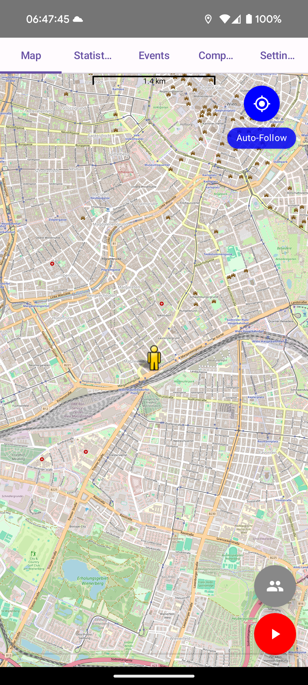
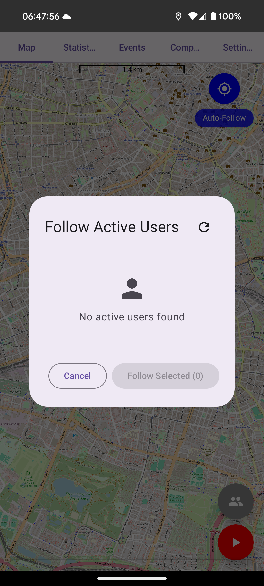
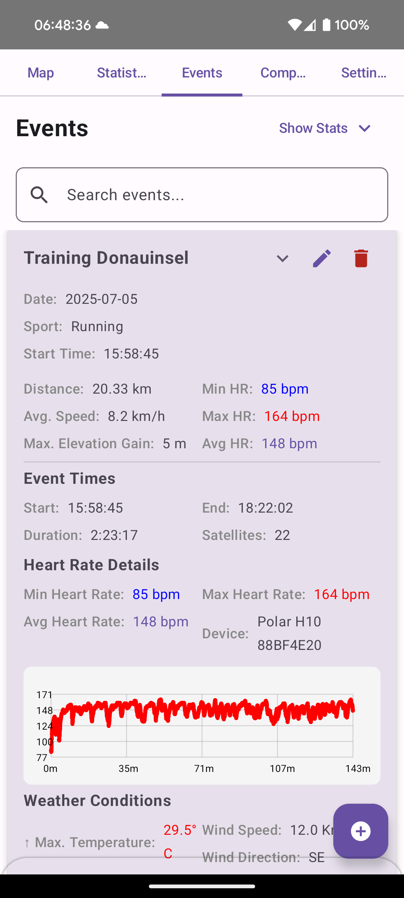
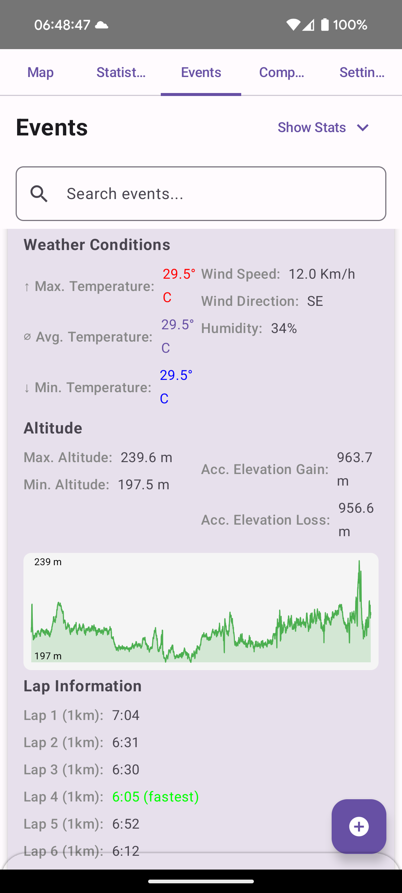
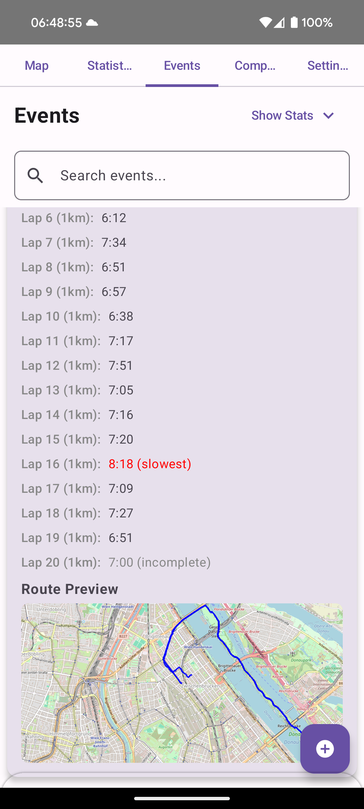
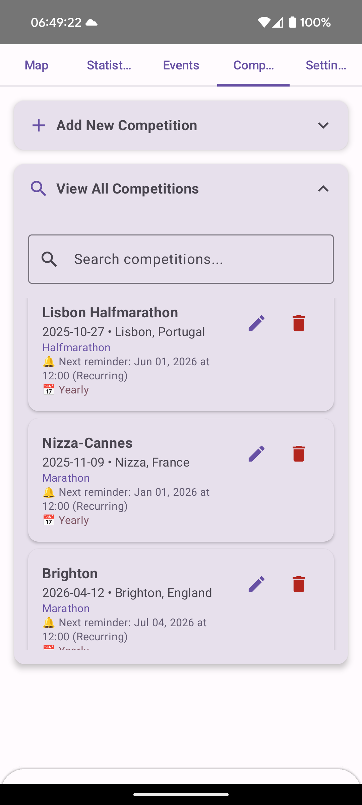
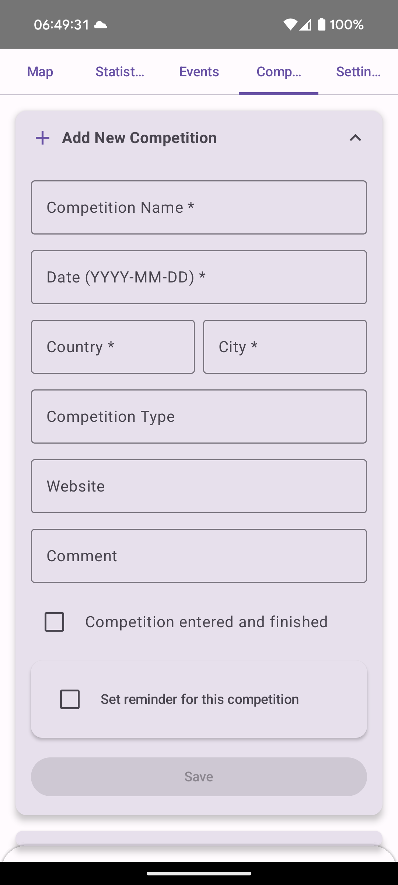
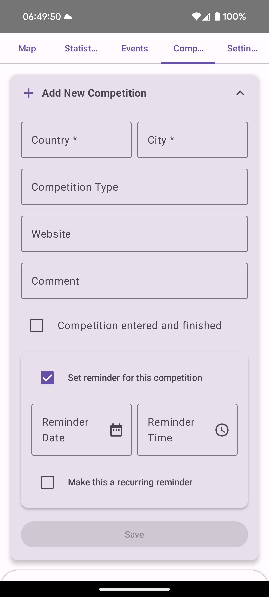
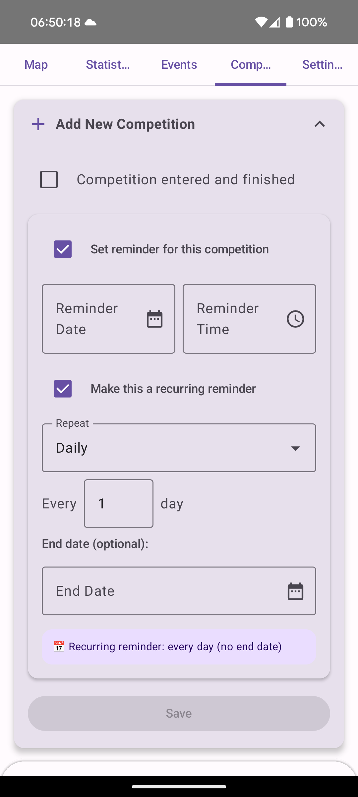

# GeoTracker App

GeoTracker is a powerful and versatile app designed for tracking your sports activities. Whether you're running, cycling, swimming, kayaking, or engaging in other sports, GeoTracker helps you record and analyze your performance.
Share your activity with others and view their progress in real-time, thanks to its integrated WebSocket server.

---

## 🚀 Features

### 🌟 Multi-Sport Tracking
GeoTracker supports tracking for a wide range of activities, including but not limited to:
- Running
- Cycling
- Swimming
- Kayaking
- and much more!

### 📊 Comprehensive Metrics
Record and analyze the following metrics:
- **Distance**: Measure how far you’ve gone.
- **Speed**: Track your current, maximum, average, and moving speeds.
- **Altitude**: Understand your elevation levels.
- **Average Speed**: Monitor consistency over your activity.
- **Time**: Log total duration.
- **Elevation Gain/Loss**: Calculate how much you’ve climbed or descended.
- **Weather Data**: Get real-time environmental information.
- **Heartrate Data**: Get real-time heartrate information from your HR monitor.

### 🗺️ OpenStreetMap Integration
Visualize your route on an interactive map:
- Displays your covered path on OpenStreetMap.
- Allows zooming and panning for a detailed view of your journey.

### 🌐 Real-Time WebSocket Server
- **Share Your Activity**: Broadcast your covered path to other users in real time.
- **View Others' Routes**: Stay connected and follow live progress of other athletes.

---

## 🛠️ Installation and Setup

1. **Clone the Repository**:
   clone the repository to your machine

3. **Run the App**:
   compile the program in Android Studio and finally run it on your mobile phone

4. **Start Docker container**:
   ```
   
   ```

5. **Access the website**:
   Open the websocket_server.py, and adapt the IP-ADDRESS.
   Then point to your browser and navigate to:
   ```
   https://[IP-ADDRESS]
   ```

---

## 📸 Screenshots











### Activity Dashboard


### Route Visualization on Map


---

## 🤝 Contributing
We welcome contributions! To contribute:

1. Fork the repository.
2. Create a feature branch:
   ```bash
   git checkout -b feature-name
   ```
3. Commit your changes:
   ```bash
   git commit -m "Add feature description"
   ```
4. Push to the branch:
   ```bash
   git push origin feature-name
   ```
5. Open a Pull Request.

---

## 📜 License

This project is licensed under the [MIT License](LICENSE).

---

## 🙋‍♂️ Support
For any issues or feature requests, please open an [issue on GitHub](https://github.com/yourusername/GeoTracker/issues) or contact us at berndroth0@gmail.com

---

## 🌟 Acknowledgments
- OpenStreetMap for the map integration.
- All contributors who make this project better!